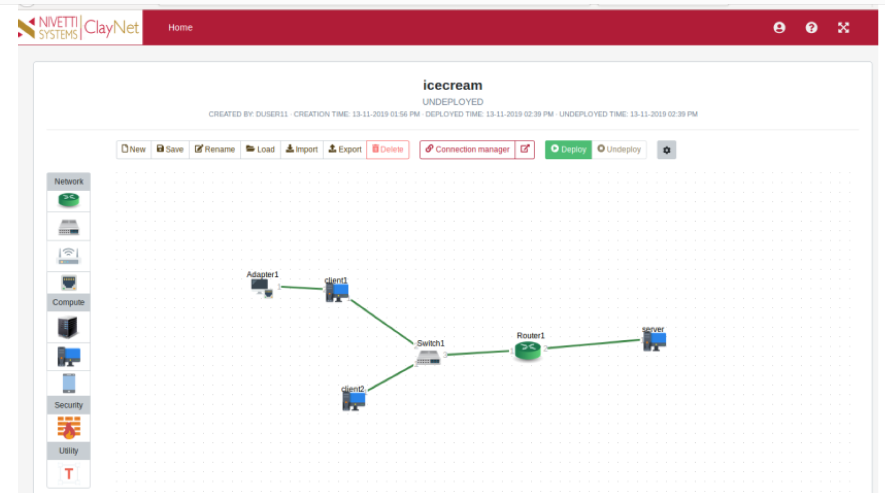

#Computer Networks
## Multi-user Quiz

The project involves a quiz given out by the teacher with multiple choice questions to all of the students simultaneously. The teacher gets the results sorted based on the marks as each student completes the quiz.

## Topology

 
Server and client modules were developed to handle multiple clients where each thread served one client.  
Sockets were used to establish communication between client and server via TCP.  
Threads were used to provide a multi client environment.  
Locks were used to synchronize between multiple threads.  
